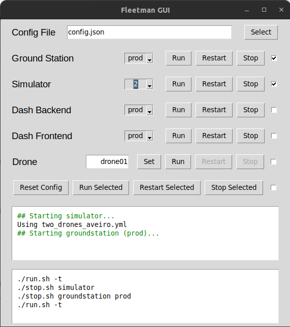

# scripts

Scripts from UAVs  
These scripts can be used towards the following services:
- [fleet-manager/groundstation](https://code.nap.av.it.pt/uavs/fleet-manager/-/tree/dev/deploy)
- [fleet-manager/simulator](https://code.nap.av.it.pt/uavs/fleet-manager/-/tree/dev/tools/sim_launcher)
- [fleet-manager/deploy](https://code.nap.av.it.pt/uavs/fleet-manager/-/tree/dev/deploy)
- [drone-backend](https://code.nap.av.it.pt/uavs/drone-backend)
- [dashboard](https://code.nap.av.it.pt/uavs/dashboard)

## Table of Contents
- [build.sh](#buildsh)
- [run.sh](#runsh)
- [stop.sh](#stopsh)
- [config.json](#configjson)
- [gui](#gui)
- [/boot](#/boot)
	- [launch_drone.sh](#launch_dronesh)

## Setup

The scripts are meant to be run from the root of a directory containing all the forementioned repositories. The script `build.sh` will do just that.

1. Begin by installing this repository:
	```bash
	git clone https://code.nap.av.it.pt/uavs/scripts.git fleetman
	cd fleetman
	```

2. Adjust the configuration file `config.json` to your needs. Please refer to the [config.json](#configjson) section for more information.

3. Run the script `build.sh` to fetch the repositories and build the services. Refer to the [build.sh](#buildsh) section for more information.
	```bash
	./build.sh
	```

4. Run the script `run.sh` to run the services, or use the gui. Refer to the [run.sh](#runsh) section for more information.
	```bash
	# run with the script
	./run.sh

	# run with the gui
	./fleetman-gui.py
	```

5. Stop the services with the script `stop.sh` or use the gui. Refer to the [stop.sh](#stopsh) section for more information.
	```bash
	./stop.sh
	```

## build.sh

This script is meant to build any of the services mentioned above.  
The repositories of the services are fetched in the beginning of the script.  
By either using the configuration file or inline arguments, it is possible to specify what to build and how to build it.  
The services ```backend``` and ```frontend``` can be built either for production (with docker), or for development (with npm and python).

### Requirements
- [x] [docker](https://docs.docker.com/engine/install/ubuntu/) and [docker-compose](https://docs.docker.com/compose/install/)
- [x] The script should be accompanied by the configuration file, [config.json](#configjson), which should be placed in the same directory as the script

### Usage

Any inline arguments will override the configuration file.  
All arguments are optional.  
Arguments must be passed in the order they are presented below.

```bash
chmod +x build.sh	# run once
./build.sh [-h] [service] [mode]
Options:
	-h:			show this help message
	service:		groundstation, backend, frontend, simulator, drone
	mode:			[dev, prod] for backend and frontend
```

## run.sh

This script is meant to run any of the services mentioned above.  
By either using the configuration file or inline arguments, it is possible to specify what to run and how to run it.  
The services ```backend``` and ```frontend``` can be run either for production (with docker), or for development (with npm and python). The service ```simulator``` can be run with a specific yml file, set in the configuration file, or with a defined number of drones (1-3), passed as an inline argument.  
By default, the services run in the background. If the ```-t``` argument is passed, the services will run in separate terminals.  
To update the services before running, the ```-u``` argument can be passed (only for the ```groundstation``` service so far).

### Requirements
- [x] All respective images must be built and available in the local docker registry (see [build.sh](#buildsh))
- [x] The script should be accompanied by the configuration file, [config.json](#configjson), which should be placed in the same directory as the script
- [x] The script must be run from the root of a directory containing all the forementioned repositories, as follows:
```bash
.
├── dashboard/
├── drone-backend/
├── fleet-manager/
├── config.json
└── run.sh
```

### Usage
Any inline arguments will override the configuration file.  
All arguments are optional.  
Arguments must be passed in the order they are presented below.

```bash
chmod +x run.sh		# run once
./run.sh [-ut] [-h] [service] [mode]
Options:
	-t: 			run the services in separate terminals
	-u:			update the services before running (groundstation)
	-h:			show this help message
	service:		groundstation, backend, frontend, simulator, drone
	mode:			[dev, prod] for backend and frontend
				<1-3> drones for simulator
				<drone_id> for drone
```

## stop.sh

This script performs ```docker-compose down``` on the services that are running docker containers and ```kill``` on the other services.

### Requirements
- [x] The script should be accompanied by run the configuration file, [config.json](#configjson), which should be placed in the same directory as the script
- [x] The script must be run from the root of a directory containing all the forementioned repositories, as follows:
```bash
.
├── dashboard/
├── drone-backend/
├── fleet-manager/
├── config.json
└── stop.sh
```

### Usage
Any inline arguments will override the configuration file.  
All arguments are optional.  
Arguments must be passed in the order they are presented below.

```bash
chmod +x stop.sh		# run once
./stop.sh [-h] [service] [mode]
Options:
	-h:			show this help message
	service:		groundstation, backend, frontend, simulator
	mode:			[dev, prod] for backend and frontend
				<1-3> drones for simulator
```

## config.json
The scripts ```build.sh```, ```run.sh``` and ```stop.sh``` depend on this configuration file.  
The file should have the following format:
```json5
{
	"services": {
		"groundstation": {
			"enabled": <boolean>, // enable groundstation deploy
			"dir": <string> // directory of the root of the groundstation repository
		},
		"backend": {
			"enabled": <boolean>, // enable backend deploy
			"dir": <string>, // directory of the root of the backend repository
			"mode": <string>, // deployment mode (dev/prod)
			"venv": <string> // name of the virtual environment from pyenv (dev mode only)
		},
		"frontend": {
			"enabled": <boolean>, // enable frontend deploy
			"dir": <string>, // directory of the root of the frontend repository
			"mode": <string> // deployment mode (dev/prod)
		},
		"simulator": {
			"enabled": <boolean>, // enable simulator deploy
			"dir": <string>, // directory of the root of the simulator repository
			"file": <string> // name of the file with the simulation configuration
		},
		"drone": {
			"enabled": <boolean>, // enable drone deploy
			"dir": <string>, // directory container the drone deploy script
			"id": <string> // drone id
		}
	},
	"repositories": {
		"fleet-manager": <string>, // url of the fleet-manager repository
		"drone-backend": <string>, // url of the drone-backend repository
		"dashboard": <string> // url of the dashboard repository"
	}
}
```

## gui

The GUI is a simple user interface that manages the services in a more user-friendly way. This python app makes an interface to the scripts aforementioned. The app also interacts directly with the `config.json` file, so it is possible to change the configuration of the services directly from it.

The GUI is a simple Tkinter app that can be run with the command:

```bash
./fleetman-gui.py
```

### UI Example



## /boot

Use this scripts on `rc.local` to launch them on boot.

### launch_drone.sh

This script is meant to launch the drone automatically on boot.

This script deals with issues such as late connection of the Flight Controller and the possibility of having several ttyACM ports available.

#### Setup

On `rc.local` add the following line:

```bash
DEPLOY_PATH=/path/to/fleet-manager/deploy /path/to/scripts/boot/launch_drone.sh <drone_id>
```

If you want to run the script manually, you can pass the port name as a second argument `<ttyACMx>`.